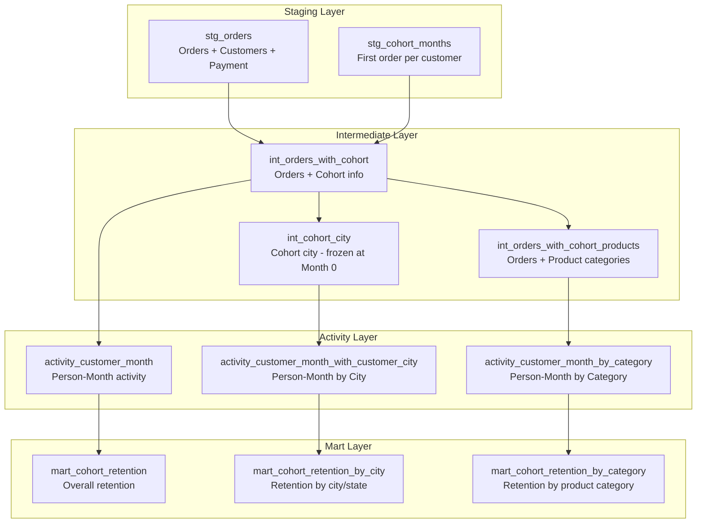

# Customer Cohort Retention Analysis

###  Project Overview
This project analyzes **customer retention and cohort behavior** for an online e-commerce platform using the publicly available **Olist dataset**.  
The objective was to track customer engagement patterns over time, understand repeat purchasing behavior, and identify which **cities**, **states**, and **product categories** exhibit stronger retention trends.

The project simulates a **data-warehouse style static pipeline**, starting from raw orders and customer data and transforming it through staged, intermediate, activity, and mart layers.

---

##  Pipeline Architecture


---

##  Data Pipeline Summary

| Layer                  | Purpose                                          | Example Transformations                                                            |
| :--------------------- | :----------------------------------------------- | :--------------------------------------------------------------------------------- |
| **Staging (STG)**      | Load raw customer, order, and payment data       | Extract order date, customer ID, payment type                                      |
| **Intermediate (INT)** | Add cohort info (first order month, cohort city) | Join customers to first order date; assign cohort month                            |
| **Activity (ACT)**     | Create person-month level tables                 | Calculate activity by month since first purchase                                   |
| **Mart (MART)**        | Aggregate retention metrics                      | Compute retention %, n_cohort, and n_active grouped by cohort, state, and category |

Each layer was built as a static SQL pipeline in BigQuery using  CTEs, joins, and aggregations.

---

## Project Workflow

1. Data Preparation
   - Imported raw Olist data (`orders`,`customers`,`payments`,`order_items`,`products`).
   - Cleaned duplicates and invalid timestamps.
   - Extracted the first purchase date per customer to define cohort month.

2. Cohort Definition & Activity Tracking
   - Each customer assigned a cohort month (`first_order_month`).
   - Measured monhtly activity (whether the customer placed an order in a given month).
     
3. Retention Calculation
   - `n_cohort` = number of new customers in each cohort's first month.
   - `n_active` = number of active customers in the subsequent months.
   - `retention_pct = a_active/n_cohort * 100`
     
   
4. Segmentation
   - Added granularity for **state** and **product category** using joins to the `customers` and `products` tables.
   - Created separate marts to analyze retention across these segments.
     
5. Visualization
   - Built interactive dashboards in Tableau showcasing cohort trends and retention dynamics across time, products categories, and states.
   - Designed parameterized filters to view **Top/Bottom N states/categories** based on retention % and to cross-highlight between charts.

---

## Dashboard


#### [Tableau Dashboard](https://public.tableau.com/app/profile/ankit.walimbe1984/viz/Olist-ecommerce/OlistE-Commerce?publish=yes)


---

  
## Dashboards Overview

1. **Customer Retention Overview**
   
   **Caption**: *Cohort retention and retention trend over time*
   - Displays overall retention decay over months since first purchase.
   - Line charts track retention by **Year-Quarter** and **Year-Month**, showing customer engagemnent drop-off patterns.
   - Reveals early-month attrition and limited long-term return rates.

2. **Product Category Retention & Trend**

   **Caption**: *Retention by Product Category*
   - Treemap highlights categories with strongest and weakest customer retention.
   - High-retention categories (e.g.,**artigos_de_festas, fraldas_higine, seguros_e_servicos**) show very high repeat behavior; low-retention categories (e.g.,**perfumaria,brinquedos,pet_shop**) trend below ~35%
   - Category trend lines show stability vs volatility over time; useful for trageting promotions.

3. **Regional Retention & Customer Activity**

   **Caption**: *State-wise retention and customer activity trends*
   - Map visualizes avegrage retention % by **state**
   - Paried line chart contrasts **aquisition (n_cohort)** vs **active customers (n_active)** over time by state.
   - Parameterized **Top/Bottom N** controls enable focusing on leading/lagging states; selecting a state highlights it across visuals.

4. **Retention % Heatmap and Trend by State**

   **Caption**: *Visualizing customer retention patterns and trends across states over time*
   - Combines a heatmap and a trend line chart for comprehensive retention analysis.
   - The heatmap shows retention percentage across cohort months for each state — highlighting how quickly customers disengage over time.
   - The trend chart tracks average retention % over time for the selected top or bottom states (controlled through the dynamic Top N filter).
   - Together, they reveal:
      - States with consistent long-term retention (e.g., strong blue shading).
      - Regions where retention collapses rapidly after the first few months.
      - Seasonal or temporal patterns in customer re-engagement.
   - Enables quick regional benchmarking and prioritization for targeted retention strategies.
     

---


  ## Key Insights

  - **Early drop-off**: Month-1 retention averages ~5%; by Month-3, retention is typically **<1%**.
  - **Category matters**: Consumable/necessity-like categories (e.g., party supplies, baby hygiene) show **very high** repeat behavior; discretionary categories (toys, perfumes) have **low** repeat rates.
  - **Geography varies**: Some northern states (e.g., **RR, AM, AC**) show stronger average retention, while several southern/central states lag.
  - **Acquisition vs activation**: High acquisition does not guarantee high retention; many states acquire well but fail to sustain activity, indicating a need for post-purchase engagement.
  - **Cohort consistency**: Decay curves are broadly similar across quarters/years; any improvements are modest and localized.


---


## Tools & Technologies

|Category                    |	Tools Used                                        |
| :------------------------- | :------------------------------------------------- |
|Data Storage /Processing    |	BigQuery                                          |
|Data Modeling               | 	SQL (CTEs, joins, aggregations, window functions) |
|Visualization               |	Tableau Desktop / Public                          |
|Versioning                  |	Git, Git LFS (for .twbx)                          |
|Dataset                     |	Olist E-commerce (public)                         |


---


## Repository Strucutre 

```
customer_cohort/
│
├── assets/
│   ├── dashboards/   → Screenshots of dashboards
│   ├── sheets/       → Individual worksheet screenshots
│   └── story/        → Tableau Story screenshots
│
├── dashboards/       → Tableau .twbx workbook (tracked via Git LFS)
├── exports/          → Exported .csvs used in Tableau
├── queries/          → SQL (STG → INT → ACT → MART)
│
├── .gitignore
├── .gitattributes
└── README.md
```

---

## Next Steps/ Extentions

- Add **RFM segmentation** (Recency-Frequency-Monetary) to identify high-value repeat buyers.
- Evaluate **category-specific seasonality** and test reactivation campaigns.
- Introduce **dbt/Airflow** to orchestrate the static pipeline.
- Tie retention to **revenue/LTV** for prioritizing markets and categories.

---

## Author 

**Ankit Walimbe** - Munich, Germany
*Data Analsyt | Data Engineer Enthusiast*
LinkedIn : linkedin.com/in/AnkitWalimbe
GitHub : github.com/AnkitWalimbe

---


